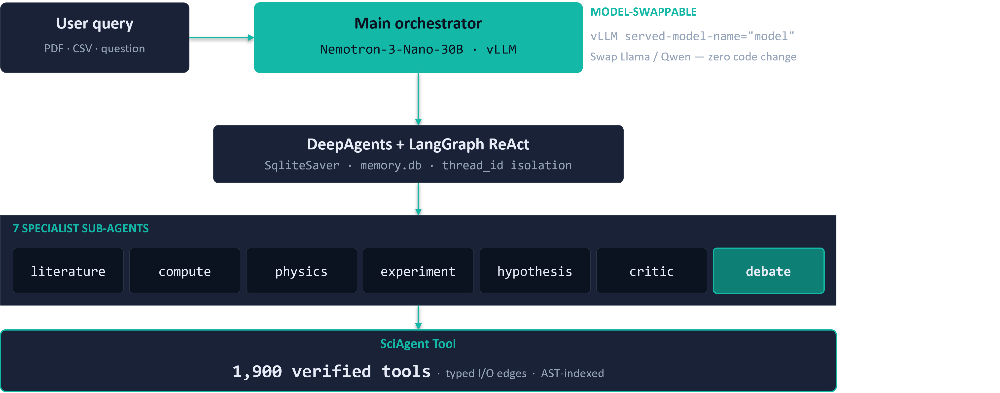
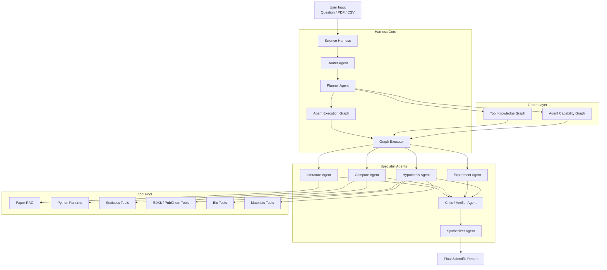

# Sci-Agent

> LLM-powered science research agent. Multi-domain (chemistry / biology / physics /
> materials / astronomy / statistics) tool use over a knowledge graph,
> BFDTS-based planning with live DAG visualization, native OCR,
> and a ChatGPT-style UI with token-level streaming.

Built on **NVIDIA Nemotron-3-Nano-30B** (via vLLM) with **DeepAgents + LangGraph**.

## Demo

[](https://youtu.be/PnsOoCcNLiQ)

*Click to watch on YouTube — planner, BFDTS graph, tool execution, and streaming reasoning shown end-to-end.*

---

## Features

- 🧠 **Nemotron-3-Nano-30B** — 262K context, native tool calling, reasoning mode
  (CoT streamed separately into a Planning panel)
- 🔧 **1,900+ tools** — 485 SciToolAgent KG tools, 1,414 SciAgentGYM Python
  functions, 11 domain shortcuts, plus Nemotron OCR V2 for images / PDFs
- 📊 **BFDTS planning** — Breadth-First Decision Tree Search over the KG, always
  executed before the agent sees the query, visualized live as a DAG in-UI
- 🛠 **DeepAgents + LangGraph** — 7 predefined subagents (literature, compute,
  physics, experiment, hypothesis, critic, debate) plus runtime
  `spawn_agent(role, task)`; persistent memory via SqliteSaver
- ⚡ **Token-level SSE streaming** — reasoning tokens → Planning panel,
  content tokens → chat; tool calls, tool results, and BFDTS trace are
  separate event types
- 💾 **Persistence** — chats (incl. Plan/Tool/Graph history) in browser
  localStorage, agent memory (per-thread) in SQLite

---

## Architecture

### High-level service layout



Four processes share one box:

| Port | Service | Role |
|---|---|---|
| 3000 | Next.js 16 | ChatGPT-style UI, SSE proxy to backend |
| 8787 | FastAPI backend | DeepAgents / LangGraph orchestration, SqliteSaver memory |
| 8000 | vLLM | Nemotron-3-Nano-30B with tool calling + reasoning parser |
| 8788 | Nemotron OCR V2 | English OCR (optional, separate Python 3.12 env) |

### Agent workflow

The backend pre-runs `make_science_plan` (BFDTS over the Tool KG) for every
user query, then lets Nemotron drive tool execution while streaming both
reasoning and content tokens back to the UI.



---

## Prerequisites

- Linux + NVIDIA GPU (tested on A100 80GB)
- CUDA 12.8, `nvcc`
- Python **3.11** for the main backend (venv)
- Python **3.12** for the Nemotron OCR server (separate conda env — upstream requirement)
- Node.js 20+ (Node 24 LTS tested)
- `git-lfs`
- A [Materials Project API key](https://next-gen.materialsproject.org/api) for
  materials tools

---

## Installation

### 1. Clone the repo

```bash
git clone https://github.com/suhyeong10/Science-Agent.git llm-for-science
cd llm-for-science
```

Vendored external code (SciToolAgent + SciAgentGYM) is already bundled under
`vendor/`. No separate cloning needed.

### 2. Python backend

```bash
pip install -r requirements.txt
```

### 3. Frontend

```bash
cd frontend
npm install
cd ..
```

### 4. Materials Project key

Either export in shell:

```bash
export MP_KEY=your_key_here
```

or add to `vendor/ToolsAgent/example.env`.

### 5. vLLM + Nemotron-3-Nano model

```bash
pip install vllm
```

Running vLLM (keep this terminal open; see [Running](#running) below).

### 6. Nemotron OCR V2 (optional — only needed if you want PDF/image OCR)

Upstream requires Python 3.12 and a from-source build:

```bash
conda create -n nemotron-ocr python=3.12 -y
conda activate nemotron-ocr
conda install -c nvidia cuda-toolkit=12.8 -y
pip install torch torchvision --index-url https://download.pytorch.org/whl/cu128
pip install pymupdf fastapi uvicorn python-multipart requests hatchling editables setuptools

git lfs install
mkdir -p ~/workspace/models && cd ~/workspace/models
git clone https://huggingface.co/nvidia/nemotron-ocr-v2
cd nemotron-ocr-v2/nemotron-ocr
# Use system gcc/g++ 11.4 — CUDA 12.8 rejects conda's bundled 14.x
CC=/usr/bin/gcc CXX=/usr/bin/g++ CUDAHOSTCXX=/usr/bin/g++ \
  pip install --no-build-isolation .
```

---

## Running

Four processes, typically four terminals.

### Terminal 1 — vLLM

```bash
vllm serve nvidia/NVIDIA-Nemotron-3-Nano-30B-A3B-BF16 \
  --served-model-name model \
  --max-num-seqs 8 --tensor-parallel-size 1 \
  --max-model-len 262144 --port 8000 \
  --trust-remote-code \
  --enable-auto-tool-choice --tool-call-parser qwen3_coder \
  --reasoning-parser nemotron_v3 \
  --gpu-memory-utilization 0.8
```

### Terminal 2 — Main backend

```bash
cd ~/workspace/llm-for-science
python3 -m backend.main     # http://127.0.0.1:8787 (internal)
```

### Terminal 3 — Nemotron OCR server (optional)

```bash
conda activate nemotron-ocr
cd ~/workspace/llm-for-science
python3 -m backend.ocr_server    # http://127.0.0.1:8788 (internal)
```

### Terminal 4 — Frontend

**Development** (HMR, slower):

```bash
cd ~/workspace/llm-for-science/frontend
npm run dev
```

**Production** (recommended for any shared use):

```bash
cd ~/workspace/llm-for-science/frontend
npm run build
npm run start
```

Open **http://localhost:3000**. Only port 3000 needs to be reachable from your
browser — the frontend proxies `/api/*` internally to the backend.

---

## Environment variables

Backend:

| Variable | Default | Purpose |
|---|---|---|
| `SCI_AGENT_BACKEND_PORT` | `8787` | Backend listen port |
| `SCI_AGENT_RELOAD` | `0` | `1` = auto-reload on code change |
| `SCI_AGENT_WORKERS` | `1` | uvicorn worker count (not combinable with reload) |

OCR server:

| Variable | Default | Purpose |
|---|---|---|
| `SCI_AGENT_OCR_PORT` | `8788` | OCR listen port |
| `SCI_AGENT_OCR_RELOAD` | `0` | auto-reload |

Frontend:

| Variable | Default | Purpose |
|---|---|---|
| `NEXT_PUBLIC_API_BASE` | `http://localhost:8787` | Backend URL for same-origin proxy target |

External APIs:

| Variable | Purpose |
|---|---|
| `MP_KEY` | Materials Project |

---

## Project structure

```
llm-for-science/
├── agent.py              # DeepAgents entry point + 7 subagent definitions
├── AGENTS.md             # Agent system prompt (injected every turn)
├── backend/              # FastAPI
│   ├── main.py           # App + CORS; port 8787
│   ├── ocr_server.py     # Standalone Nemotron OCR V2 server; port 8788
│   ├── patches.py        # langchain_openai patch for Nemotron `reasoning` field
│   └── api/
│       ├── chat.py       # POST /api/chat — SSE token-level stream
│       └── upload.py     # POST /api/upload — multipart → workspace/
├── frontend/             # Next.js 16 + Tailwind v4 + React 19
│   ├── app/
│   │   ├── page.tsx      # Root chat page; handleSend, SSE event routing
│   │   ├── api/chat/route.ts  # Streaming proxy (rewrites buffer SSE)
│   │   └── globals.css
│   ├── components/       # Sidebar, ChatInput, PlanPanel, ToolPanel,
│   │                     # BfdtsGraph, Markdown, CopyButton, ...
│   └── lib/              # api.ts, types.ts, persistence.ts, fileIcon.tsx, ...
├── tools/                # LangChain @tool wrappers
│   ├── scitool_tools.py  # SciToolAgent KG shortcuts + run_scitool dispatcher
│   ├── gym_tools.py      # SciAgentGYM AST-index + dynamic loader
│   ├── kg_planner.py     # BFDTS algorithm over KG graph_store.json
│   ├── planner.py        # make_science_plan — mandatory first tool
│   ├── _bfdts_trace.py   # thread_id-keyed trace side-channel for UI
│   ├── dynamic_agent.py  # spawn_agent for runtime subagent creation
│   ├── unified_search.py # Cross-source search
│   └── registry.py       # SciToolAgent tool category registry
├── skills/               # SKILL.md per domain (Skills middleware auto-injects)
├── workspace/            # User-uploaded files (gitignored)
├── vendor/               # 12 MB — vendored external code
│   ├── ToolsAgent/       # SciToolAgent functions + Config + .env templates
│   ├── KG/               # graph_store.json (SciToolAgent Knowledge Graph)
│   ├── gym/              # SciAgentGYM runtime (4 files)
│   └── toolkits/         # 183 GYM function files
├── memory.db             # SqliteSaver per-thread agent memory (gitignored)
└── requirements.txt
```

---

## Example queries

Chemistry:

- `Calculate molecular weight and Lipinski's Rule of 5 for aspirin.`
- `Give me the SMILES of caffeine and its LogP.`
- `What functional groups are in ibuprofen?`

Biology:

- `Translate this DNA: ATGGCC... and compute the protein pI/MW.`
- `Align these two sequences: ACCGTA... / ACGCTA...`

Materials:

- `What is the band gap and density of TiO2? Is it metallic?`
- `Search for lithium-containing materials in the Materials Project.`

Physics / Astronomy:

- `Calculate the orbital period of Earth around the Sun using Kepler's Third Law.`
- `Doppler shift for 440 Hz source moving at 30 m/s toward a stationary observer. Speed of sound = 343 m/s.`

Debate (multi-agent):

- `What hypotheses explain the Warburg effect in cancer cells?`

With file attachment (upload a PDF via the `+` button):

- `OCR this paper and summarize its methods section.`

---

## Concurrent users

**This setup is tuned for 1-2 concurrent users.** For a small group demo this is
comfortable; vLLM handles the LLM side and the BFDTS trace side-channel is
keyed by `thread_id` so simultaneous plans don't bleed into each other.

To scale beyond 2:

1. Raise vLLM `--max-num-seqs` (e.g. 16, 32) — requires VRAM headroom; increase
   `--gpu-memory-utilization` to 0.85-0.9 if needed.
2. `SCI_AGENT_WORKERS=N python3 -m backend.main` for multi-process uvicorn.
3. Run the frontend in production mode (`npm run build && npm run start`).
4. Swap LangGraph's SqliteSaver for `langgraph-checkpoint-postgres` if write
   contention shows up in profiling.

---

## Troubleshooting

**vLLM: `Reasoning parser 'nano_v3' not found`**
The flag name is `--reasoning-parser nemotron_v3` (not `nano_v3`).

**vLLM: `Failed to load plugin register_paddlex_genai_models`**
Harmless if PaddleX is installed in the same venv from a separate project. To
silence:
```bash
VLLM_PLUGINS="" vllm serve ...
```

**Backend: `openai.NotFoundError: model 'model' does not exist`**
The vLLM server needs `--served-model-name model` and `--enable-auto-tool-choice --tool-call-parser qwen3_coder`. The first /v1/chat/completions call right after vLLM startup can return 404 transiently while the model warms up — it resolves within a few seconds.

**Agent skips `make_science_plan`**
The backend pre-runs the planner every turn and injects its output into the
user message, so the KG / BFDTS trace is always populated regardless of Nemotron's tool-call compliance.

**Materials tools: `formula Field required` validation error**
Fixed — all materials tools use the unified parameter name `formula`.

**PDF upload: OCR 500 error**
Nemotron OCR V2 only accepts JPEG / PNG / WebP / GIF natively. The bundled
OCR server detects PDFs and rasterizes each page with PyMuPDF before calling
the model. Ensure `pymupdf` is installed in the `nemotron-ocr` conda env.

**Frontend: infinite loading**
Usually stale browser state. DevTools → Application → Clear site data, or
open an incognito window. If still blank, run the frontend in production
mode — dev mode has known concurrency issues.

---

## Credits

- [NVIDIA Nemotron-3-Nano-30B](https://huggingface.co/nvidia/NVIDIA-Nemotron-3-Nano-30B-A3B-BF16) — base LLM
- [NVIDIA Nemotron OCR V2](https://huggingface.co/nvidia/nemotron-ocr-v2) — OCR model
- [SciToolAgent](https://github.com/SciToolAgent/SciToolAgent) — KG + chem / bio / materials tool functions
- [SciAgentGYM](https://github.com/SciAgentGYM) — 1,414 physics / astronomy / statistics Python functions
- [DeepAgents](https://github.com/langchain-ai/langgraph) · [LangGraph](https://langchain-ai.github.io/langgraph/) · [Next.js](https://nextjs.org/) · [Tailwind](https://tailwindcss.com/)

Vendored external code under `vendor/` retains its original license — see each
upstream repo for details.
